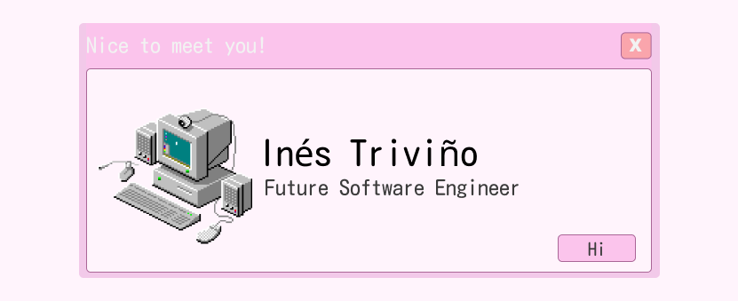

<!--TODO hacer que esto linkee a mi página-->

# System.out.println("Hi there");
I'm Inés and I am a software engineering student at the Complutense University of Madrid. This profile is quite a bit empty right now due to being a work in progress!

## 💻 Current tech stack
- Java
- C++
- SQL

When it comes to IDEs I work with Eclipse, VSCode and IntelliJ Idea. 

## 💿 Other things
I am currently in the process of improving and expanding my knowledge through both formal and self education. I am also working on starting to contribute to open source projects. I'll see you around!
